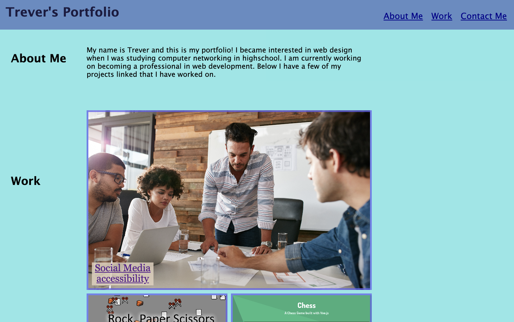

# my-portfolio-webpage

## Description

This is a portfolio website I made in order to showcase projects that I have worked on, and accomplishments I have made in my development career. This site is just the initial version and will be updated as I complete more projects, and learn HTML and CSS better

- My motivation was to make myself a portfolio in order to show projects that I have worked on or contributed to

- I build this website as a reference to projects I have worked on and for potential future emplyers

- If somebody were to ask me for a portfolio or asked what projects I have worked on, I can direct them to this site.

- I learned how to use HTML and CSS more than I previously did, and want to continue to expand on that knowledge

